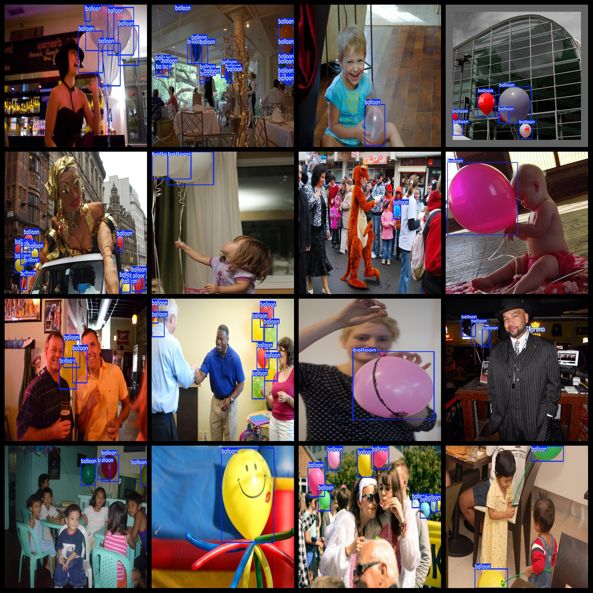

# Balloon Dataset 1136 imagesVOC+YOLO format

The balloon dataset consists of 1136 images in both VOC and YOLO formats.

The dataset format includes VOC format plus YOLO format.

The compression package contains three folders, each storing images, xml files, and txt files.

The total number of JPEG images in the JPEGImages folder is 1136.

The total number of XML files in the Annotations folder is 1136.

The total number of txt files in the labels folder is 1136.

There are a single type of label: "balloon".

The number of bounding boxes (note that the order in yolo format does not correspond to this, but rather, it is based on the classes.txt file in the labels folder):

- Number of balloon boxes = 8015
- Total number of boxes = 8015

The resolution of the images is clear.

The images have not been enhanced.

The GitHub repository location is datasets_sl.

The shape of the labels is rectangular boxes, used for object detection recognition.

Important Note: No special statement regarding accuracy guarantee for trained models or weight files has been made. The dataset provides accurate and reasonable annotations only.

The annotation and picture situation is as follows:

## Images

---

Here is a pay link on Stripe (https://buy.stripe.com/3cs8yP7sY87d0vu9AB). Please contact me lonlonago@foxmail.com after funding $89, and I will send you a complete data files, thank you!

